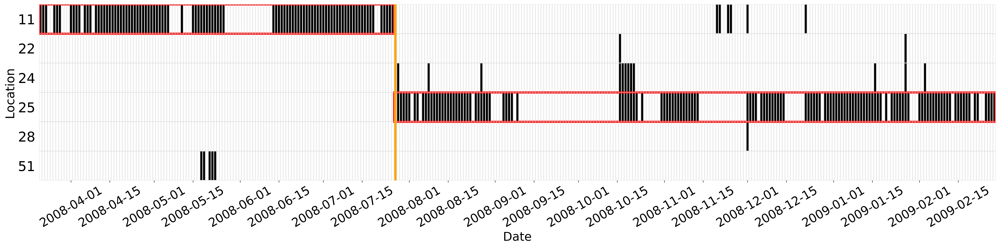

migrantion_detector
======
migrantion_detector is a Python toolbox to detect migration events in digital trace data, such as Call Detail Record (CDR), geo-tagged tweets, and other check-in data.

How to install it
======
`pip install migrantion_detector`

Dependencies
======
migrantion_detector has a dependency on [turi/GraphLab](https://turi.com/) to accelerate the computing speed. You need to apply for a [license](https://turi.com/download/academic.html) and [install](https://turi.com/download/install-graphlab-create.html) it before installing migrantion_detector. It requires a Python 2.7.x environment.
